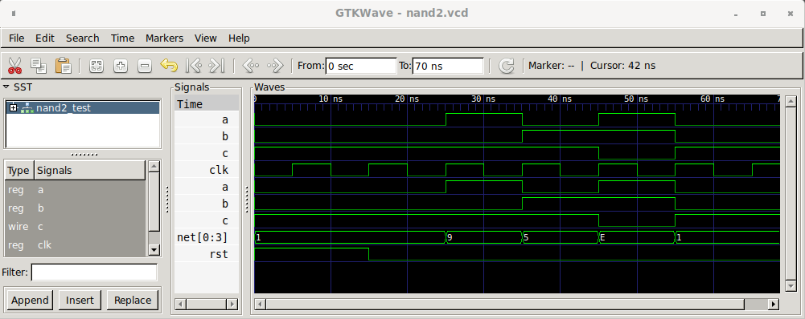

# Cava Examples

This directory describes a few example circuits produced using
the  [Cava](https://github.com/project-oak/oak-hardware/tree/master/cava) system which needs
to be installed before the circuits and proofs can be generated in this directory.

To build the examples in this directory just run `make`:

```bash
$ make
```

# A NAND gate
A simple NAND gate build out of an AND gate and an inverter, along
with a proof about correct operation.

```coq
Definition nand2 {m t} `{Cava m t} := and_gate >=> not_gate.

Definition nand2Top {m t} `{CavaTop m t} :=
  setModuleName "nand2" ;;
  a <- inputBit "a" ;
  b <- inputBit "b" ;
  c <- nand2 [a; b] ;
  outputBit "c" c.

Definition nand2Netlist := makeNetlist nand2Top.

(* A proof that the NAND gate implementation is correct. *)
Lemma nand2_behaviour : forall (a : bool) (b : bool),
                        combinational (nand2 [a; b]) = negb (a && b).
Proof.
  auto.
Qed.
```

This generates the following SysteVerilog code:

```verilog
module nand2(
  input logic b,
  input logic a,
  output logic c
  );

  logic[0:3] net;

  // Wire up inputs.
  assign net[1] = b;
  assign net[0] = a;
  // Wire up outputs.
  assign c = net[3] ;

  not inst3 (net[3],net[2]);
  and inst2 (net[2],net[0],net[1]);

endmodule
```

The Makefile compiles the generated SystemVerilog and runs it with
a checked in testnench [nand2_tb.vs](https://github.com/project-oak/oak-hardware/blob/master/cava-examples/nand2_tb.sv)
which produces a VCD waveform file which can be viewed with a VCD viewer like
[gtkwave](http://gtkwave.sourceforge.net/):



# A half adder
A straight-forward implementation of a half adder using only SystemVerilog
primitive gates, along with a proof about correct operation:

```coq
Definition halfAdder {m t} `{Cava m t} a b :=
  partial_sum <- xor_gate [a; b] ;
  carry <- and_gate [a; b] ;
  return_ (partial_sum, carry).

Definition halfAdderTop {m t} `{CavaTop m t} :=
  setModuleName "halfadder" ;;
  a <- inputBit "a" ;
  b <- inputBit "b" ;
  ps_c <- halfAdder a b ;
  outputBit "partial_sum" (fst ps_c) ;;
  outputBit "carry" (snd ps_c).

Definition halfAdderNetlist := makeNetlist halfAdderTop.

(* A proof that the the half-adder is correct. *)
Lemma halfAdder_behaviour : forall (a : bool) (b : bool),
                            combinational (halfAdder a b) = (xorb a b, a && b).

Proof.
  intros.
  unfold combinational.
  unfold fst.
  simpl.
  case a, b.
  all : reflexivity.
Qed.
```

# Full Adder
A straight-forward full adder made usign the half adder shown above, along
with a proof about correct operation:

```coq
Definition fullAdder {m t} `{Cava m t} a b cin :=
  abl_abh <- halfAdder a b ;
  abcl_abch <- halfAdder (fst abl_abh) cin ;
  cout <- or_gate [snd abl_abh; snd abcl_abch] ;
  return_ (fst abcl_abch, cout).

Definition fullAdderTop {m t} `{CavaTop m t} :=
  setModuleName "fulladder" ;;
  a <- inputBit "a" ;
  b <- inputBit "b" ;
  cin <- inputBit "cin" ;
  sum_cout <- fullAdder a b cin ;
  outputBit "sum" (fst sum_cout) ;;
  outputBit "carry" (snd sum_cout).


Definition fullAdderNetlist := makeNetlist fullAdderTop.

(* A proof that the the full-adder is correct. *)
Lemma fullAdder_behaviour : forall (a : bool) (b : bool) (cin : bool),
                            combinational (fullAdder a b cin)
                              = (xorb cin (xorb a b),
                                 (a && b) || (b && cin) || (a && cin)).
Proof.
  intros.
  unfold combinational.
  unfold fst.
  simpl.
  case a, b, cin.
  all : reflexivity.
Qed.
```

This generates the following SystemVerilog code:

```verilog
module fulladder(
  input logic cin,
  input logic b,
  input logic a,
  output logic carry,
  output logic sum
  );

  logic[0:7] net;

  // Wire up inputs.
  assign net[2] = cin;
  assign net[1] = b;
  assign net[0] = a;
  // Wire up outputs.
  assign carry = net[7] ;
  assign sum = net[5] ;

  or inst7 (net[7],net[4],net[6]);
  and inst6 (net[6],net[3],net[2]);
  xor inst5 (net[5],net[3],net[2]);
  and inst4 (net[4],net[0],net[1]);
  xor inst3 (net[3],net[0],net[1]);

endmodule
```

However, the Xilinx Vivado FPGA implementation tools will fail to map
this onto the fast carry components (CARRRY8, XORCY, MUXCY) to achieve
a fast implementation. This design is mapped to two LUTs which is 
sub-optimal.

## A Fast-carry based full adder
This is another version of a full adder which explicitly uses the
XORCY and MUXCY components to ensure a mapping to the fast carry chain:

```coq
Definition fullAdderFC {m t} `{Cava m t} a b cin :=
  part_sum <- xor_gate [a; b] ;
  sum <- xorcy cin part_sum ;
  cout <- muxcy cin a part_sum ;
  return_ (sum, cout).

Definition fullAdderFCTop {m t} `{CavaTop m t} :=
  setModuleName "fulladderFC" ;;
  a <- inputBit "a" ;
  b <- inputBit "b" ;
  cin <- inputBit "cin" ;
  sum_cout <- fullAdderFC a b cin ;
  outputBit "sum" (fst sum_cout) ;;
  outputBit "carry" (snd sum_cout).


Definition fullAdderFCNetlist := makeNetlist fullAdderFCTop.

(* A proof that the the full-adder is correct. *)
Lemma fullAdderFC_behaviour : forall (a : bool) (b : bool) (cin : bool),
                              combinational (fullAdderFC a b cin)
                               = (xorb cin (xorb a b),
                                   (a && b) || (b && cin) || (a && cin)).
Proof.
  intros.
  unfold combinational.
  unfold fst.
  simpl.
  case a, b, cin.
  all : reflexivity.
Qed.
```

This generates the following SystemVerilog code:

```verilog
  input logic cin,
  input logic b,
  input logic a,
  output logic carry,
  output logic sum
  );

  logic[0:5] net;

  // Wire up inputs.
  assign net[2] = cin;
  assign net[1] = b;
  assign net[0] = a;
  // Wire up outputs.
  assign carry = net[5] ;
  assign sum = net[4] ;

  muxcy inst5 (net[5],net[2],net[0],net[3]);
  xorcy inst4 (net[4],net[2],net[3]);
  xor inst3 (net[3],net[0],net[1]);

endmodule
```

Which does map efficiently onto the fast-carry chain:

